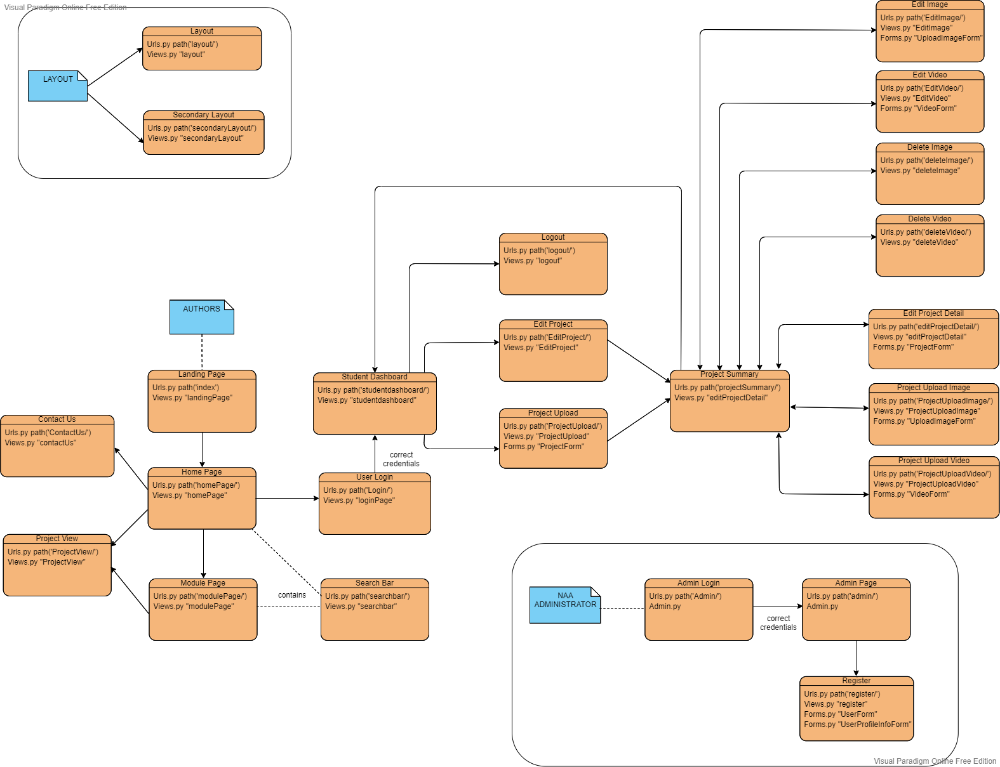

Welcome to the **Gen-O readme**

## Table of Contents
| **No.** | **Section**                       | **Quick Navigation**                        |
|---------|-----------------------------------|---------------------------------------------|
| 1       | The Gen-O Team                    | [Get to know us!](#the-mi-team)             |
| 2       | Project Development               | [Check our work!](#analyses-from-labs)      |
| 3       | Assessment Deliverables           | [Assessment info](#assessment-deliverables) |
| 4       | Source Code                       | [Inspect code](#source-code)                |

## The Gen-O Team
To get to know us, visit our [website](http://gen-o.josephthenara.com/) to view our profile.
##### Members
The project won't happen without these awesome people!

- Joseph M. THENARA
- Gabrielle S. HADIAN
- Aurelie U-KING IM
- Patricia WONG 
- Kevin FERDINAND
- Ivan C. HALIM
- Li-Kai (Kelvin) WU 

##### GRP Supervisor 
- Dr Dave Towey 

## Project Description

The Digital Artefact Showcase Platform project was initiated to improve the platform for showcasing the work of the students at University of Nottingham Ningbo China (UNNC). This project was introduced as part of Software Engineering GRP module.

## Steps to Activate the Website
    
1. Unzip the ZIP file.
2. Inside please find the "Installation Manual" and follow it.
3. Ensure that you are able to reach the "Welcome page" after step 2.
4. Find a file called "User Manual" to see details of the website functions.

## Code Hierarchy

## Code Structure

Below is the description of each file inside gen-o-grp-2020/condaENV/Website_GRP

home_page =
    <ul>
        <li> home_page : A directory which holds all the website backend code. </li>
        <li> home_page/migrations : A folder used by Django to save files of database structure. </li>
    </ul>

media =
    <ul>
        <li> media/artefacts : Holds all the artefacts that is or will be uploaded to the website. </li>
    </ul>

static =
    <ul>
        <li> static/css : All files regarding CSS. </li>
        <li> static/font-awesome-4.7.0 : All files used to style fonts in the website </li>
        <li> static/images : Used to store images that will always exist on the website. e.g : UNNC logo </li>
        <li> static/javascript : All files regarding Javascript. </li>
        <li> static/vendor : All files regarding Bootstrap and JQuery </li>
    </ul>

templates : 
     <ul>
        <li> Stores all the HTML files of this website </li>
    </ul>

Website_GRP :
     <ul>
        <li> Stores the backend code needed to run the website</li>
    </ul>

